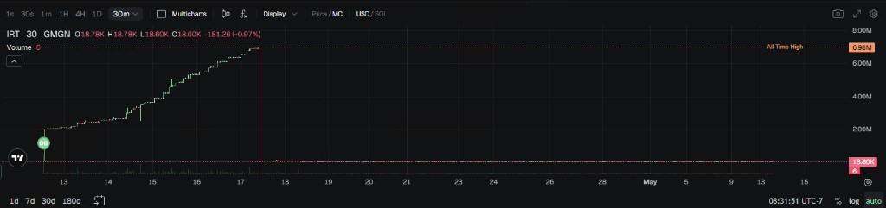
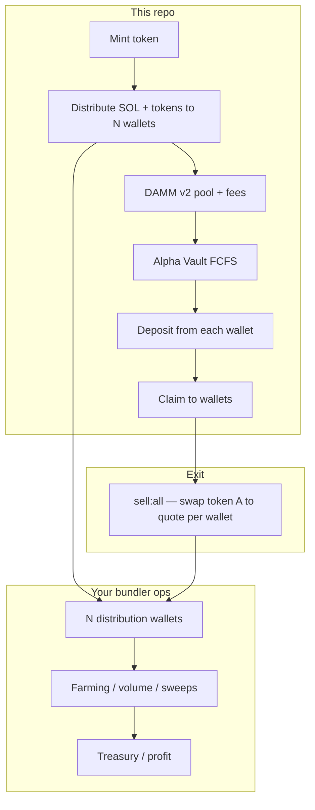

# Meteora Bundler Launch

**Meteora DAMM v2 + Alpha Vault (FCFS) launch toolkit** for teams that run **large wallet-count bundlers**—from a handful to **100+ wallets, and well beyond** (there is no hard cap in the tooling; set `DISTRIBUTE_NUM` to match your bundle size). This repository is the **on-chain launch spine**: mint the token, create the **custom pool** wired for Alpha Vault, then attach the **FCFS vault**. The same **distribution wallet fleet** is what you use for **vault deposits, claims, bulk exits (`sell:all`), and downstream farming** (LP positions, incentive claims, volume and sweeps)—while your **bundler ops stack** (dashboard, workers, schedulers) runs the longer-lived loops; this project keeps the **Meteora primitives** repeatable and env-driven.

> **Goal:** Launch with a fair timetable (delayed activation, caps), fee structure suited to **ongoing trading and LP fee capture**, and artifacts (`data/*.json`) your downstream automation can consume for **volume, sweeps, farming, and profit realization** across **large wallet sets** (100+ is a common target; scale `DISTRIBUTE_NUM` as needed).

### 100+ wallet bundles and farming with the same wallets

- **Bundle size:** Use `DISTRIBUTE_NUM` (or aliases) for **10, 100, 200+** keys—the flows are the same; scale **main-wallet SOL**, **RPC throughput**, and optional **`DISTRIBUTION_TX_DELAY_*`** so bursts stay within your provider limits.
- **Launch path:** `distribute:from-main` materializes the fleet (keystore + `LAUNCH_STATE_PATH`); `deposit:vault` and `claim:tokens` walk **every** distribution signer so large bundles stay in sync with one pool and one vault.
- **Farming / post-launch:** After activation and claims, you typically **farm with this same key set**: e.g. holding or rotating base through **`npm run sell:all`**, plus **LP fee harvesting**, **reward programs**, and **scheduled buys/sells** per wallet in your own automation—the repo hands you one **canonical pool address**, **vault timing**, and **all secret keys** in the keystore for those workers to target.

### Sample token — rug-pool style example (reference)

Example Solana meme token page on Axiom (mint `CDprTdvzeXtRvovZHi5g8b763LWsXJbjdXVzF3v2z3Qq`), kept here as a **chart + link reference** for this repo’s workflow docs only—not financial advice or an endorsement:

[Open token on Axiom](https://axiom.trade/meme/CDprTdvzeXtRvovZHi5g8b763LWsXJbjdXVzF3v2z3Qq?chain=sol)



---

## Why bundlers use this stack

- **Many wallets (100+ and beyond):** This repo **creates or reuses** a keystore of `DISTRIBUTE_NUM` keys (no fixed upper bound—**100+ wallet bundles** are explicitly supported), funds them from the **main** `WALLET_SECRET_KEY`, and uses them for **FCFS deposits** and **claims**. The same keys are the natural unit for **farming** and **bulk `sell:all`** once your external runners connect to the keystore and launch state.
- **Farming & profit:** After go-live, typical objectives are **organic-looking flow**, **reward harvesting** (LP fees, incentives), and **consolidation** to treasury or “profit” wallets. A **dynamic fee layer on top of a scheduled base fee** keeps short-term MEV and toxic flow more expensive while longer-hold reads cleaner—supporting sustained activity without giving away the entire curve on block zero.
- **Dynamic fee + fixed base fee (Meteora pattern):** Pool creation here uses Meteora’s **time-scheduled base fee** (`FeeTimeSchedulerExponential`) **plus** optional **dynamic fee** (`POOL_ENABLE_DYNAMIC_FEE`, `POOL_DYNAMIC_BASE_FEE_BPS`). That combination:
  - caps runaway fee spikes via a **stable base schedule**;
  - lets **volatility / flow** push fees higher when the pool is stressed;
  - increases **claimable LP trading fees** in busy periods while keeping launch economics legible for participants.
- **Alpha Vault FCFS:** Staged deposits and a known **activation point** align the whole bundler fleet to the same clock—critical when coordinating **>100** signing keys.

---

## What this repository runs

### One-shot pipeline

| Command | Role |
|--------|------|
| `npm run start` | **End-to-end:** mint → fund `DISTRIBUTE_NUM` wallets from the main key → DAMM v2 custom pool (Alpha) → FCFS Alpha Vault → sync `data/latest-launch-state.json` → wait for deposit window → **deposit from each distribution wallet** → wait for vesting → **claim** tokens to those wallets. |
| `npm run dev` | Same as `start`, re-runs on file changes (`tsx watch`). |
| `npm run sell:all` | **After** claims (or whenever wallets hold token A), market-sell **all token A** from **every** distribution wallet on the Meteora CP-AMM pool—built for **large fleets** (concurrency/stagger via env). Pair with your own farming jobs for LP and rewards on the same wallet set. |

### Individual steps (same modules `start` calls)

| Step | Command | Role |
|------|---------|------|
| 1 | `npm run mint:token` | SPL / Token-2022 mint + metadata; writes `data/latest-token-mint.json`. |
| 2 | `npm run distribute:from-main` | Creates or loads `DISTRIBUTION_WALLETS_KEYSTORE_PATH`, sends **SOL** (and optionally **project tokens**) from `WALLET_SECRET_KEY` to each wallet; writes/updates **`LAUNCH_STATE_PATH`**. |
| 3 | `npm run launch:dammv2` | DAMM v2 **custom pool** with `hasAlphaVault: true`; writes `data/latest-pool.json`. |
| 4 | `npm run create:alpha-vault:fcfs` | FCFS Alpha Vault; writes `data/latest-alpha-vault.json`. |
| 5 | `npm run sync:launch-state` | Merges pool + vault artifacts into `LAUNCH_STATE_PATH` (also run automatically at the end of `start` after vault creation). |
| 6 | `npm run deposit:vault` | Each distribution wallet **deposits quote** into the Alpha Vault during the open window (WSOL: uses balance minus `DISTRIBUTION_WALLET_SOL_FEE_BUFFER_LAMPORTS`). |
| 7 | `npm run claim:tokens` | After `startVestingPoint`, each wallet **claims** allocated base tokens from the vault. |

For manual or stepwise runs, keep **`DRY_RUN=true`** on pool/vault until you are ready to send those transactions; distribution and deposit always send real txs when executed (fund your main wallet accordingly).

---

There is **no** built-in vault **fill** or crank in this package—if your FCFS flow requires an explicit fill before activation, run that with Meteora’s tools or your ops stack once deposits are in.

---

## Architecture (high level)



---

## Quick start

```bash
git clone <your-fork> && cd Meteora-Bundler-Launch
npm install
cp .env.example .env   # edit all placeholders
```

**Full bundler sequence** (configure `DISTRIBUTE_NUM`, `DISTRIBUTION_SOL_PER_WALLET_LAMPORTS`, caps, and timing first):

```bash
npm run start
```

**Piecemeal:** use the table in *What this repository runs* (`mint:token` → `distribute:from-main` → `launch:dammv2` → `create:alpha-vault:fcfs` → `sync:launch-state` → `deposit:vault` → `claim:tokens`).

**Exit:** after wallets hold unlocked base (post-claim or any time they have token A on the pool):

```bash
npm run sell:all
```

`npm run start` blocks in polite wait loops until the **deposit** window opens and until **vesting** allows claims (`ORCHESTRATOR_POLL_SEC`, `ORCHESTRATOR_MAX_WAIT_SEC`). Re-run `deposit:vault` or `claim:tokens` alone if a run exited early.

Use **`DRY_RUN=true`** on **pool/vault** scripts while iterating; set **`false`** when sending those txs. **`distribute:from-main`**, **`deposit:vault`**, **`claim:tokens`**, and **`sell:all`** are live when executed.

---

## Environment (essentials)

**Always required for real launches (see source for full validation):**

- `RPC_URL` — Solana HTTP RPC (quality matters at scale).
- `WALLET_SECRET_KEY` — Launch signer (base58 or JSON byte array).
- `CONFIG_ADDRESS` — Meteora DAMM v2 **config** PDA (fee bounds & pool genetics).
- `TOKEN_A_INPUT_AMOUNT_RAW` — Initial token A liquidity input (raw units).

**Pool / quote:**

- `QUOTE_MINT_TYPE` — `WSOL` or `USDC`.
- `CONNECT_ALPHA_VAULT_POOL` — `true` for custom Alpha-connected pool path (default intent of this project).
- `POOL_ACTIVATION_POINT_TS` — Unix seconds for delayed activation (bundler-friendly scheduling).
- `POOL_OUTPUT_PATH`, `TOKEN_MINT_OUTPUT_PATH`, `ALPHA_VAULT_OUTPUT_PATH` — artifact paths (defaults under `data/`).

**Fee ladder + dynamic component (profitable, busy pools):**

- `POOL_STARTING_FEE_BPS`, `POOL_ENDING_FEE_BPS` — ends of the exponential time schedule.
- `POOL_FEE_NUMBER_OF_PERIOD`, `POOL_FEE_TOTAL_DURATION_SEC` — schedule shape.
- `POOL_ENABLE_DYNAMIC_FEE` — `true` to add Meteora dynamic fee on top of the base schedule.
- `POOL_DYNAMIC_BASE_FEE_BPS` — base point for the dynamic curve.
- `POOL_COLLECT_FEE_MODE` — `0` BothToken / `1` OnlyB (match your **CONFIG**; affects where fees accrue).

- `DISTRIBUTE_NUM` — Count of distribution wallets (aliases: `DISTRIBUTION_WALLET_COUNT`, `BUNDLE_DISTRIBUTE_NUM`). Use **100+** (or more) for large bundles; plan funding and RPC accordingly.
- `DISTRIBUTION_SOL_PER_WALLET_LAMPORTS` **or** `DISTRIBUTION_TOTAL_SOL_LAMPORTS` — SOL per wallet for fees + vault deposit (WSOL quote path deposits “all minus buffer” on-chain).
- `BUNDLE_DISTRIBUTE_TOKEN_RAW_TOTAL` — Optional: total base token (raw) split evenly from main to each wallet (for later sells or inventory).
- `DISTRIBUTION_WALLETS_KEYSTORE_PATH`, `LAUNCH_STATE_PATH` — Keystore + merged launch JSON for deposit/claim.
- `ORCHESTRATOR_POLL_SEC`, `ORCHESTRATOR_MAX_WAIT_SEC`, `START_SKIP_MINT` — `npm run start` behavior.

**Sell all (`npm run sell:all`):**

- `POOL_ADDRESS` or `TARGET_POOL_ADDRESS` overrides pool discovery from launch state / `POOL_OUTPUT_PATH`.
- `SLIPPAGE_BPS`, `SELL_ALL_RETRY_MAX`, `SELL_ALL_RETRY_STEP_BPS`, `SELL_ALL_CONCURRENCY`, `SELL_ALL_STAGGER_MS`.

**Alpha Vault (FCFS):**

- Caps, whitelist mode, deposit windows—see `src/alpha-vault-fcfs.ts` and Meteora docs for `ALPHA_FCFS_*` style variables present in your `.env`.

**Token mint:**

- Token program, decimals, supply, metadata, Pinata—see `src/token_mint.ts` and your `.env`.

---

## Operating model for 100+ wallets and farming

1. **Launch** with `npm run start` or the stepwise scripts; freeze `POOL_ADDRESS`, vault, and activation time in your ops DB.
2. **Distribution wallets** live in `DISTRIBUTION_WALLETS_KEYSTORE_PATH` and are mirrored in `LAUNCH_STATE_PATH` for deposit/claim bookkeeping—this is the **same fleet** you will use for **farming** and coordinated exits unless you rotate keys off-chain.
3. **Deposit / trade** only inside published windows; respect cap and whitelist rules or you will waste txs.
4. **After activation**, run your **farming policy** across the bundle:
   - spread flow across many signers so activity does not collapse into a single obvious wallet;
   - **claim LP fees**, **farm incentives**, and run **volume / rebalance** jobs on a schedule that respects RPC rate limits;
   - use **`npm run sell:all`** when you want a **pooled exit** from token A on the Meteora pool; sweep proceeds to treasury or cold storage with audit trails.
5. **Fees:** Re-read Meteora’s pool fee docs whenever you change `CONFIG_ADDRESS` or fee envs—misaligned `collectFeeMode` vs config is a common foot-gun.

---

## Security & compliance

- Never commit `.env` or keystores. Treat `data/*` outputs as sensitive when they contain mints, pool addresses, or paths to secrets.
- Use **dedicated launch keys**; rotate after mainnet campaigns.
- **Devnet first:** dry-run wiring, metadata, and clock math before touching mainnet.
- This software moves real funds; you are responsible for legal, tax, and exchange policy compliance in your jurisdiction.

---

## Troubleshooting

| Symptom | Check |
|--------|--------|
| `CONFIG_ADDRESS` errors | Config pubkey must match cluster; fee min/max must allow your init price. |
| Pool already exists | Change mint pair or reuse existing pool deliberately (`CONNECT_ALPHA_VAULT_POOL=false` path skips create in some branches—read `damm-v2-launch.ts`). |
| Vault create fails | `POOL_ADDRESS`, timing, caps, whitelist mode vs your `.env`. |
| “No dynamic fee” / unexpected fees | `POOL_ENABLE_DYNAMIC_FEE`, `POOL_DYNAMIC_BASE_FEE_BPS`, and on-chain config state. |

---

## Outputs (downstream automation)

- `data/latest-token-mint.json`
- `data/latest-pool.json`
- `data/latest-alpha-vault.json`
- `data/latest-launch-state.json` (distribution wallets, deposit/claim progress, pool + vault addresses when synced)
- `data/distribution-wallets.keystore.json` (by default — **secret** material; never commit)

---

## Roadmap ideas (not in repo today)

- Multi-hop SOL privacy routing for distribution
- LaserStream listener + reactive rules
- Treasury sweeps and P&L reporting beyond `sell:all`

---

## FCFS vs. your bundler fleet

**First-come, first-served** Alpha Vault fits high-wallet launches when:

- you want a **simple mental model**: valid deposits until cap, then crank fill before activation;
- **speed** and operational parallelism matter more than exact pro-rata allocation;
- your automation can **retry and race** deposit txs without a heavy allocation reconciliation step.

If you later need **Pro Rata**, you still keep the same pool/fee story; only the vault-side deposit accounting and communication change—this repo stays the canonical **pool + vault creation** layer.

---

## Mainnet checklist (operator)

- [ ] `CONFIG_ADDRESS` matches `POOL_COLLECT_FEE_MODE` and your Meteora fee preset (static vs dynamic-on-config nuances—verify on docs).
- [ ] `POOL_ENABLE_DYNAMIC_FEE` / `POOL_DYNAMIC_BASE_FEE_BPS` reviewed against expected first-hour volume.
- [ ] `POOL_ACTIVATION_POINT_TS` synchronized with public announcements and bundler job schedulers.
- [ ] All `data/*.json` backed up off-box; signer keys not stored next to repos in CI.
- [ ] RPC provider rate limits sized for **burst** from 100+ wallets (multiple providers or queueing).
- [ ] Runbook: who owns mint, pool tx, vault tx, and who aborts if RPC or clock skew.

---

## Token mint reminders (`token_mint.ts`)

Pinata / IPFS metadata is easy to get wrong under pressure. Before mainnet:

- Confirm **image** path or URL resolves publicly.
- Confirm **decimals** match downstream price UI and bundler math.
- Write down **mint authority** / freeze policy decisions; many launches revoke mint auth after mint—plan that before pool liquidity is locked.

---

## Disclaimer

This code executes **real on-chain transactions**. Testing and operational risk are yours. Past performance of a fee model does not guarantee future revenue; **dynamic fees** alter trader behavior and MEV—in backtests and production.

## License

Specify your license (MIT, Apache-2.0, proprietary, etc.) before public distribution.

## Contact

- Telegram: [@Kei4650](https://t.me/Kei4650)
