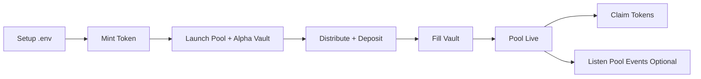

# Meteora Alpha Vault Bundler
High-level launch framework for Meteora DAMM v2 + Alpha Vault on Solana.
Built for anti-sniper token launches with controlled timing, staged deposits, and deterministic execution.

## Overview
This project automates the full launch lifecycle:
- mint token + metadata
- create DAMM v2 pool
- create/configure Alpha Vault
- distribute funds to participant wallets
- deposit in vault window
- fill close to activation
- claim after lock/vesting
- monitor pool events in real time
- optionally run reactive sell-then-buy logic

The design goal is operational reliability and launch fairness, not just script convenience.

## Why Anti-Sniper
Most launch failures are operational:
- instant activation with no sequencing
- poor cap controls
- no monitoring during first trading minutes
- no runbook discipline

This repository reduces those risks through a structured sequence:
1) stage deposits first
2) delay activation to a known timestamp
3) execute fill in valid buffer window
4) enforce claim lock / vesting timeline
5) monitor market behavior from the first transaction

No system is bot-proof, but this model greatly improves fairness vs unmanaged opens.

## Launch Modes: FCFS and Pro Rata
Meteora Alpha Vault launches usually follow one of two allocation styles.

### FCFS (First Come, First Served)
- deposits accepted until cap is reached
- earlier valid deposits get priority
- simpler operations and lower coordination overhead
- useful when speed and straightforward UX matter most

### Pro Rata
- deposits collected through a fixed window
- allocation proportional to deposit share
- stronger fairness under oversubscription
- reduces pure latency advantage from ultra-fast bots

Repo note:
- command flow in this repository is FCFS-first
- README includes Pro Rata launch guidance for teams that extend the same architecture

## Core Principles
- predictable launch timeline
- explicit operational checkpoints
- persisted state files between steps
- monitoring enabled by default
- safety-first controls (`DRY_RUN`, caps, buffers)

## Lifecycle
Typical flow:
1. prepare `.env`, wallet, metadata
2. run token mint
3. run pool + alpha vault launch
4. distribute wallets and funds
5. deposit during allowed period
6. fill near fill window
7. pool activates at configured point
8. claim after lock/vesting criteria
9. continue monitoring and post-launch operations

## Easy Workflow (One Look)
If you only want the simple flow, use this:



Quick meaning:
- **Setup `.env`**: wallet, RPC, config, LaserStream keys
- **Mint Token**: create token + metadata
- **Launch Pool + Alpha Vault**: create launch infrastructure
- **Distribute + Deposit**: fund wallets and deposit into vault
- **Fill Vault**: execute fill in valid time window
- **Pool Live**: trading active at activation point
- **Claim Tokens**: users claim after lock/vesting rules
- **Listen Pool Events (optional)**: monitor and run reactive logic

## Capabilities
- command-by-command automation
- flow-level orchestration around time windows
- JSON state files for reproducible launch ops
- live LaserStream-based event parsing
- optional trigger-based sell/buy logic
- mainnet-oriented execution model

## Quick Start
```bash
npm install
cp .env.example .env
```

Set minimum required values in `.env`:
- `WALLET_SECRET_KEY`
- `RPC_URL`
- `PINATA_API_KEY`
- `PINATA_SECRET_API_KEY`
- `CONFIG_ADDRESS`
- `LASERSTREAM_API_KEY`
- `LASERSTREAM_ENDPOINT`

Run common launch path:
```bash
npm run mint:token
npm run launch:with-alpha-vault
npm run distribute:and:deposit
npm run fill:vault
npm run claim:tokens
```

Run monitoring:
```bash
npm run listen:pool
```

## Command Map
Core commands:
- `npm run mint:token` - mint token + metadata
- `npm run launch:with-alpha-vault` - create pool + vault launch setup
- `npm run create:alpha-vault:fcfs` - FCFS vault create path
- `npm run distribute:funds` - fund participant wallets
- `npm run deposit:to-vault` - deposit-only step
- `npm run distribute:and:deposit` - combined distribution/deposit flow
- `npm run wait:deposit:then:fill` - wait-aware orchestration
- `npm run fill:vault` - execute fill in window
- `npm run claim:tokens` - claim post-lock tokens
- `npm run sell:pool:token` - sell Token A into quote token
- `npm run listen:pool` - stream and classify pool events

## Environment Structure
### Network + Wallet
- `RPC_URL`
- `CLUSTER` (optional)
- `WALLET_SECRET_KEY`

### Token
- decimals, supply, metadata fields, image path
- output file path fields

### Pool + Vault
- `CONFIG_ADDRESS`
- `QUOTE_MINT_TYPE` (`WSOL` / `USDC`)
- `CONNECT_ALPHA_VAULT_POOL`

### Timing
- `POOL_ACTIVATION_POINT_TS`
- `ALPHA_FCFS_DEPOSIT_OPEN_BUFFER_SEC`
- `FILL_BUFFER_SEC_BEFORE_ACTIVATION`
- lock/vesting/claim timing values

### Caps & Access
- `ALPHA_FCFS_MAX_DEPOSITING_CAP_RAW`
- `ALPHA_FCFS_INDIVIDUAL_CAP_RAW`
- whitelist mode and related fee options

### Distribution
- wallet count
- total amount
- randomization switch
- fee buffer values

### Monitoring
- `LASERSTREAM_API_KEY`
- `LASERSTREAM_ENDPOINT`
- `TARGET_POOL_ADDRESS`
- `POOL_EVENTS_OUTPUT_PATH`

### Reactive Trading (Optional)
- `TARGET_BUY_AMOUNT`
- `SELL_PERCENTAGE`
- `BUY_PERCENTAGE`
- `POOL_ADDRESS`
- `DRY_RUN`

## FCFS Operating Playbook
Use when speed and simple operations matter:
1. set FCFS cap + timeline
2. create pool and vault
3. distribute funds
4. deposit in window
5. fill in valid buffer
6. wait for activation
7. claim after lock

Operational note:
- keep `npm run listen:pool` active during activation and early trading.

## Pro Rata Playbook (High-Level)
Use when fairness under oversubscription is key:
1. publish deposit open/close windows
2. collect all deposits through close
3. compute proportional allocations
4. apply same disciplined fill/activation windows
5. communicate claim timing clearly

Anti-sniper controls remain the same:
- delayed activation
- cap discipline
- claim lock/vesting
- continuous monitoring

## Monitoring and Trigger Logic
`listen:pool` provides real-time pool visibility and classification.
Optional reactive logic currently supports:
1. detect `Buy` where `amountB > TARGET_BUY_AMOUNT`
2. sell `SELL_PERCENTAGE` of wallet Token A
3. buy Token A with `BUY_PERCENTAGE` of resulting quote amount

This supports controlled post-trigger position response.

## Output Files
Important artifacts:
- `data/latest-token-mint.json`
- `data/latest-pool.json`
- `data/latest-alpha-vault.json`
- `data/latest-launch-state.json`
- `data/distribution-wallets.keystore.json`
- `data/middle-wallets.keystore.json` (if enabled)

Treat keystore outputs as secrets.

## Security and Operations Hygiene
- never commit `.env`
- never share private keys/keystores
- use dedicated launch wallets
- test on devnet before mainnet
- keep SOL fee reserves above expected burst
- save signatures for critical transactions
- avoid mid-window parameter changes

## Mainnet Checklist
Before launch:
- validate env completeness
- validate metadata upload
- validate timing windows
- validate cap parameters
- validate state file paths
- validate LaserStream credentials

During launch:
- run commands in strict order
- monitor stream and explorer in parallel
- capture tx signatures and timestamps
- track window boundaries carefully

After launch:
- monitor early market behavior
- run claim schedule as planned
- archive launch artifacts securely

## Troubleshooting
Deposit/fill failed:
- usually wrong timing window or low SOL fee balance
- re-check timing fields and wallet balances

Pool address missing:
- set `TARGET_POOL_ADDRESS` or `POOL_ADDRESS`
- verify `LAUNCH_STATE_PATH` target

No events in listener:
- verify API key and endpoint region
- verify pool address and cluster match

Child trade script not running:
- verify env inheritance
- test child command with `DRY_RUN=true`

## Team Execution Model
Recommended roles:
- launcher (runs timed commands)
- watcher (monitoring + explorer)
- verifier (balances/caps/checkpoints)

Maintain shared timeline and signature log for all critical steps.

## Disclaimer
This software executes real on-chain actions and can move funds.
Use at your own risk and test thoroughly before production.

## License
Add preferred license (`MIT`, `Apache-2.0`, proprietary, etc.) per distribution model.

## Contact
- Telegram: [@Kei4650](https://t.me/Kei4650)
